# 预览分支 · 贡献图动画候选

> 只用来看效果，不会出现在主页上。每个 SVG 都是用 SKeyerror 自己的贡献图生成的。

## 1. 俄罗斯方块 · leereilly/contribution-graph-art

5 块方块从上往下落，8 秒一轮，配色自动跟随明暗模式。

<picture>
  <source media="(prefers-color-scheme: dark)" srcset="preview/tetris.svg"/>
  
</picture>

## 2. Python 蛇 v2 · Platane/snk + pythonize_snake.py

蓝头白眼、后半身黄；底部进度条已去掉，画布随之裁矮。
蛇的路线上放了 6 个 logo 当食物，按时间均匀分布：PostgreSQL → Greenplum → C++ → C → Rust → Go。
蛇头经过时 logo 缩小消失，一轮 70 秒，循环开始时重新长出来。

<picture>
  <source media="(prefers-color-scheme: dark)" srcset="preview/snake-python-dark.svg"/>
  <source media="(prefers-color-scheme: light)" srcset="preview/snake-python.svg"/>
  
</picture>

## 3. 对照 · 原版贪吃蛇（Tokyo Night 紫）

<picture>
  <source media="(prefers-color-scheme: dark)" srcset="preview/snake-original-dark.svg"/>
  <source media="(prefers-color-scheme: light)" srcset="preview/snake-original.svg"/>
  
</picture>

---

深色版单独看：[tetris](preview/tetris.svg) · [snake-python-dark](preview/snake-python-dark.svg) · [snake-original-dark](preview/snake-original-dark.svg)
